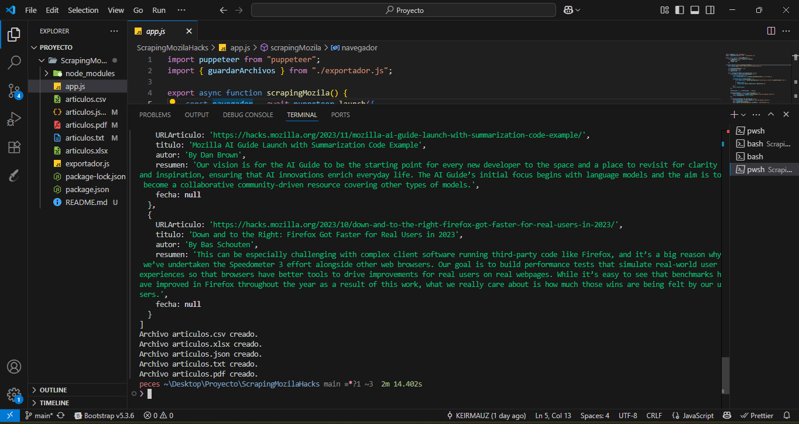

# Scraper de Artículos de Hacks Mozilla

## Descripción

Este proyecto es un scraper web desarrollado en Node.js que extrae información de los artículos publicados en [Hacks Mozilla](https://hacks.mozilla.org/articles/). Utiliza Puppeteer para navegar y recopilar datos como título, autor, URL, resumen y fecha de publicación de los artículos. Además, los datos extraídos se exportan en múltiples formatos: CSV, XLSX, JSON, TXT y PDF.

---



## Instalación y Ejecución

### Requisitos previos

- Tener instalado [Node.js](https://nodejs.org/) (versión 14 o superior recomendada).
- Conexión a internet para acceder al sitio web y descargar dependencias.

### Pasos para instalar dependencias

1. Clona el repositorio (o descarga el proyecto):

```bash
git clone https://github.com/tu-usuario/tu-repo.git

